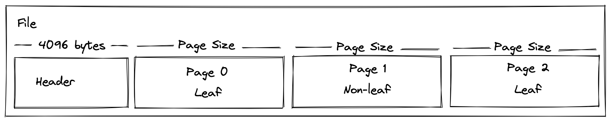
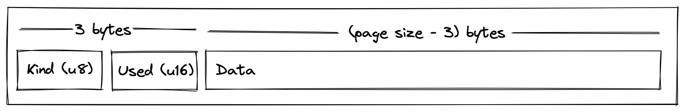
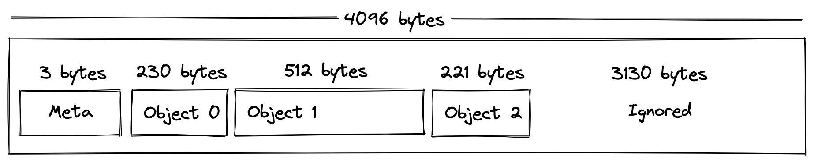
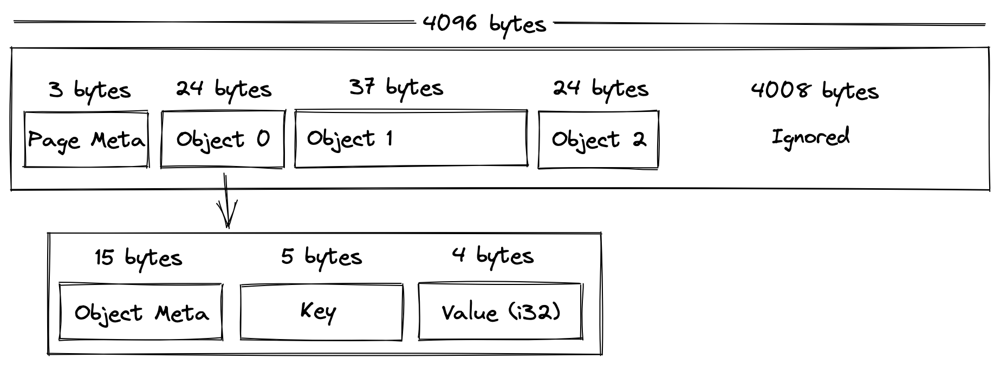
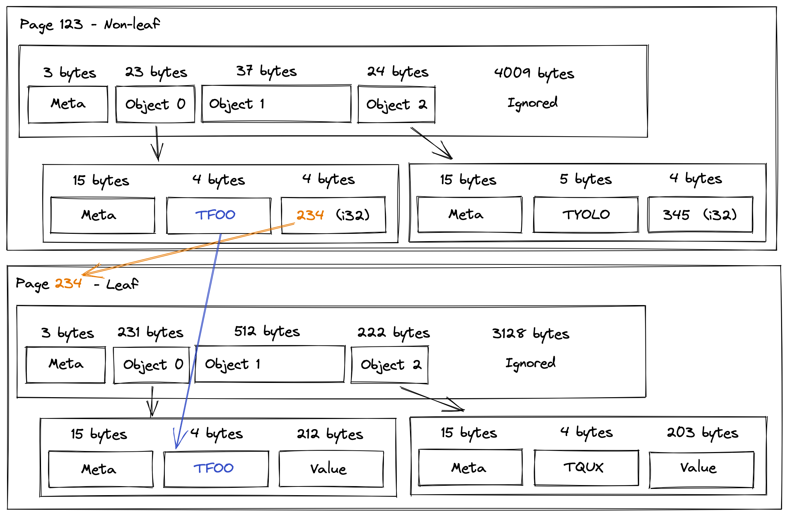
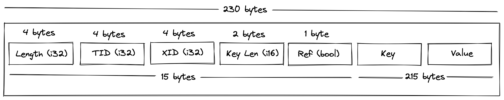
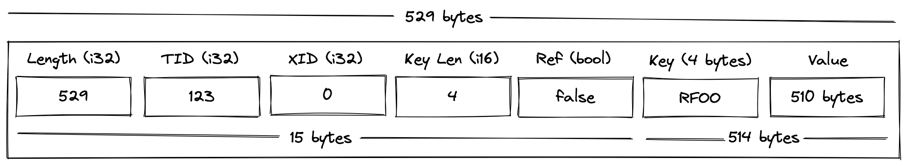
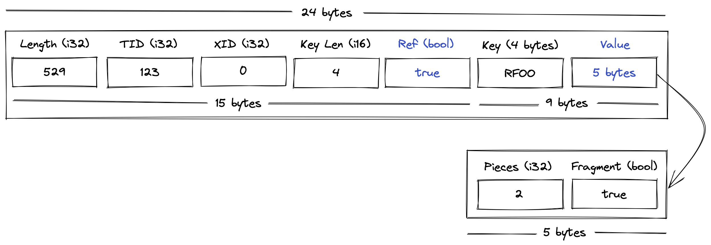

File Format
===========

.. contents::

Overview
--------

vsql stores the entire database (also known as the catalog) in a single file.
The default extension is ``.vsql``, although that is not required.

The file must include a *Header*, followed by zero or more pages. That is, when
the database file is initially created it will only have a *Header* and zero
pages.

Every page must be the same size, but this is configurable. The page size cannot
be changed after the file is created (the page size is stored in the *Header*).

A page can be one of two types: leaf and non-leaf, and they may appear in any
order in the file. They may also be reordered or removed as the file expands and
contracts.

Also see :doc:`limitations`.

Header
------

The header is always 4kb (4096 bytes). Not all of this space is used, the
remaining space is filled with zeros and can be ignored.

The contents of the Header is best explained by looking at the code. See
``struct Header`` in
https://github.com/elliotchance/vsql/blob/main/vsql/header.v.

Page
----

All pages types (defined by *Kind*) will use the same basic structure with 3
bytes reserved for metadata and the remaining bytes available for *Data*. The
format of the data itself will depend on the *Kind*:

.. list-table::
  :header-rows: 1

  * - Kind
    - Page Type

  * - 0
    - `Leaf Page`_

  * - 1
    - `Non-leaf Page`_

Since *Used* has a max value of 65536 this is also the maximum possible size
for a page. Although, the default page size for new files is 4096 bytes. [1]_

The *Used* includes the size of *Meta*. So an empty page would have a *Used* of
3 and an entirely full page would have a *Used* equal to the page size.

Leaf Page
---------

The first 3 bytes are reserved for *Meta*, which will contain the kind (``0``
for leaf) and the number of used bytes (remember that it also contains the
size of *Meta*).

The *Data* will contain zero or more objects. Although, zero objects is valid if
that were the case the page should be removed as part of the garbage collection.

Each `Object`_ may be variable length and can be any number of bytes so long as
the *Object* size is equal to or less than the (page size - 3). For objects that
cannot fit into a page, they are stored in as a `Blob Object`_ and referenced
from the *Object*.

Objects within a page are kept sorted by key and unused space is always located
after the used data. You should not assume that the unused portion is zeroed.

Non-leaf Page
-------------

A non-leaf page share a lot of similarities with a `Leaf Page`_. However, the
Objects are pointers to Leaf pages. That is the *Value* within the *Object* is a
i32 that references the `Leaf Page`_ number.

Objects within a non-leaf page are ordered based on the objects *Key*. This is
important for scanning (such as range queries) to improve performance as the
*Key* itself is the first *Key* in the referenced `Leaf Page`_. Here is an
example of how a `Non-leaf Page`_ references a `Leaf Page`_:

It's also important to note that as the B-tree gets larger, there may be
multiple non-leaf pages that need to be traversed this way. The process will
always end with a leaf page. A parent of a non-leaf (which must also be a
non-leaf) uses the *Key* that points to the first *Key* in the child page.

Object
------

An Object may be any length, but this example uses an object of 230 bytes:

Individual objects can be of different types and are encoded/decoded based on
the first byte of the *Key*:

.. list-table::
  :header-rows: 1

  * - First Byte
    - Object Type

  * - ``B``
    - `Blob Object`_

  * - ``F``
    - `Fragment Object`_

  * - ``R``
    - `Row Object`_

  * - ``S``
    - `Schema Object`_

  * - ``T``
    - `Table Object`_

Every object contains 15 bytes of metadata:

.. list-table::
  :header-rows: 1

  * - Part
    - Format
    - Description

  * - *Length*
    - i32 (4 bytes)
    - Is the total length of the object (including the metadata).

  * - *TID*
    - i32 (4 bytes)
    - Transaction ID that created this object. [2]_

  * - *XID*
    - i32 (4 bytes)
    - Transaction ID that expired this object. [2]_

  * - *Ref*
    - u8 (1 byte)
    - When ``true``, the *Value* will be 5 bytes containing. See `Blob Object`_.

  * - *Key Len*
    - i16 (2 bytes)
    - The number of bytes in the proceeding *Key*.

Using this metadata we can say that the length of *Value* will be: (*Length* -
15 - *Key Length*).

Blob Object
-----------

When an object is added to the B-tree that is too large to fit into a single
page, it must be split into *blob* (B) and *fragment* (F) objects. For example,
if the page size was 256 bytes, but we try to insert a object that is 529 bytes:

It is split into 3 objects:

.. image:: img/file-format-blob-2.png

Where entire pages consist of one more blob objects followed by an optional
fragement object containing any left over data. The fragment is optional because
the object might happen to fit perfectly in a whole number of blob objects.

Finally, the original object is replaced with a reference (blue indiciated
replacements):

Fragment Object
---------------

A fragment object (uses the prefix ``F``) contains a portion of data from
splitting a large object. See `Blob Object`_.

Row Object
----------

A Row Object (has the ``R`` prefix) contains a table row. The serialization does
not need to be explained in detail here. You can check the code for
``Row.bytes()`` and ``new_row_from_bytes()`` respectively.

Schema Object
-------------

A Schema Object (has the ``S`` prefix) contains a schema definition. The
serialization does not need to be explained in detail here. You can check the
code for ``Schema.bytes()`` and ``new_schema_from_bytes()`` respectively.

Table Object
------------

A Table Object (has the ``T`` prefix) contains a table definition. The
serialization does not need to be explained in detail here. You can check the
code for ``Table.bytes()`` and ``new_table_from_bytes()`` respectively.

Notes
-----

.. [1] See ``default_connection_options()`` in
   https://github.com/elliotchance/vsql/blob/main/vsql/connection.v.

.. [2] This is used for transaction visibility. See :doc:`mvcc`.
